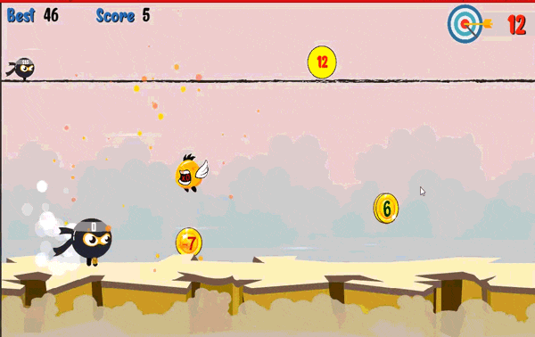

# Counting-Mario
Counting Mario is an endless runner game where you have to complete a certain target  by adding or subtracting different numbers. 

# Goal
If your number is less than target number, you die 

# Mechanism
- Left Click to make jumps 
- The Number on Mario's head shows the current number 
- Random coin value will spawn between positive or negative numbers from 1 to 9
- The mini map on top shows your distance from the target number 
- Complete the target by taking or leaving different coins according to what the target number demands 
- You Current number just have to be greater than the target number 
- The more you survive the more score you get. 
- Finally , keep the goal in mind 

